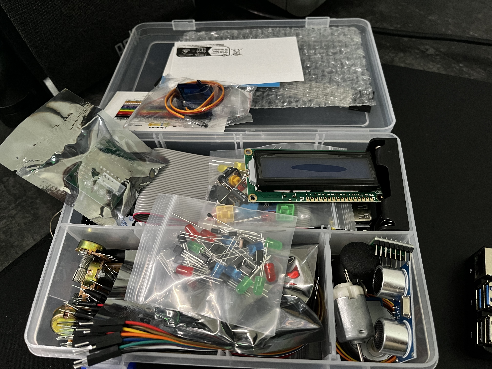

# RaspberryPi5.GPIO
Repo to have some fun and learn GPIO in RaspberryPi5. I'm using Freenove Ultimate Starter Kit for Raspberry Pi

## GPIO Scheme

## My RaspberryPi

## Freenove Ultimate Starter Kit for Raspberry Pi
